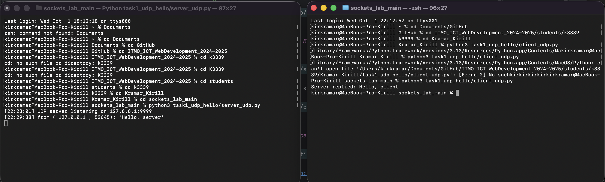

# Задание 1 — UDP «Hello»

**Требование:** использовать `socket`, протокол **UDP**.  
**Сценарий:** клиент отправляет строку `Hello, server`, сервер её печатает и отвечает `Hello, client`.

---

## Как выполнено
**Сервер** (`task1_udp_hello/server_udp.py`):
1. Создаём UDP-сокет: `socket.socket(AF_INET, SOCK_DGRAM)`.
2. Привязываем адрес: `sock.bind((HOST, PORT))`.
3. В бесконечном цикле: `data, addr = sock.recvfrom(4096)`, печатаем и отвечаем `sock.sendto(b"Hello, client", addr)`.

```python
with socket.socket(socket.AF_INET, socket.SOCK_DGRAM) as sock:
    sock.bind((HOST, PORT))
    while True:
        data, addr = sock.recvfrom(4096)
        text = data.decode("utf-8", errors="replace")
        print(f"from {addr}: {text!r}")
        sock.sendto(b"Hello, client", addr)
```

**Клиент** (`task1_udp_hello/client_udp.py`):
1. Одноразовая отправка: `sock.sendto(b"Hello, server", (HOST, PORT))`.
2. Таймаут на ответ: `sock.settimeout(3.0)`.
3. Приём: `data, _ = sock.recvfrom(4096)`, далее печать ответа.

```python
with socket.socket(socket.AF_INET, socket.SOCK_DGRAM) as sock:
    sock.sendto(b"Hello, server", (HOST, PORT))
    sock.settimeout(3.0)
    data, _ = sock.recvfrom(4096)
    print("Server replied:", data.decode("utf-8", errors="replace"))
```

---

## Разбор синтаксиса
- `socket.socket(AF_INET, SOCK_DGRAM)` — UDP (IPv4)
- `bind((host, port))` — слушать порт
- `recvfrom(bufsize)` — принять **датаграмму** и адрес
- `sendto(data, addr)` — отправить **датаграмму**
- `settimeout(seconds)` — таймаут I/O

---

## Скриншоты
- 

