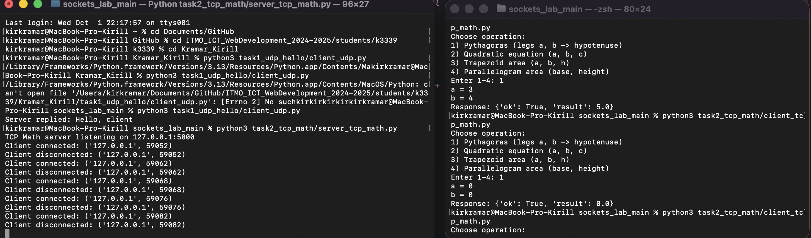

# Задание 2 — TCP «Математика»

**Требование:** `socket`, протокол **TCP**.  
**Сценарий:** клиент выбирает математическую операцию, сервер выполняет и возвращает результат.

---

## Протокол: JSON per line (JSONL)
TCP — поток байт без границ сообщений. Чтобы «кадрировать» сообщения, используем **разделитель `\n`**.

**Запрос:**
```json
{"op":"pythagoras","params":{"a":3,"b":4}}
```

**Ответ:**
```json
{"ok": true, "result": 5.0}
```

---

## Как выполнено
**Сервер** (`task2_tcp_math/server_tcp_math.py`):
- Инициализация TCP: `socket(..., SOCK_STREAM)`, `setsockopt(SO_REUSEADDR,1)`, `bind`, `listen`.
- На **каждого клиента** — `threading.Thread`.
- Построчное чтение: `conn.makefile("rwb", buffering=0)` + `readline()`.
- Парсим JSON → считаем → возвращаем JSON (заканчиваем `\n`).

```python
with socket.socket(socket.AF_INET, socket.SOCK_STREAM) as srv:
    srv.setsockopt(socket.SOL_SOCKET, socket.SO_REUSEADDR, 1)
    srv.bind((HOST, PORT))
    srv.listen()
    while True:
        conn, addr = srv.accept()
        threading.Thread(target=handle_client, args=(conn, addr), daemon=True).start()
```

```python
def handle_client(conn, addr):
    with conn:
        f = conn.makefile("rwb", buffering=0)
        while True:
            line = f.readline()
            if not line: break
            payload = json.loads(line.decode("utf-8"))
            op = payload.get("op"); params = payload.get("params", {})
            # ... вычисления ...
            f.write((json.dumps(out) + "\n").encode("utf-8"))
```

**Клиент** (`task2_tcp_math/client_tcp_math.py`):
- Собирает `payload` из ввода пользователя → `sendall((json+"\n").encode())` → читает до `\n` → печать.

---

## Поддерживаемые операции
1. **Пифагор** — `math.hypot(a, b)` (устойчивее точностно).
2. **Квадратное уравнение** `ax^2 + bx + c = 0`:
   - Проверка `a != 0`.
   - При `D < 0` — возвращаем комплексные корни строками `"real±imagi"`.
3. **Площадь трапеции** — `((a + b) / 2) * h`.
4. **Площадь параллелограмма** — `base * height`.

---

## Почему сделал так?
- **JSONL** — простое, читаемое кадрирование поверх TCP.
- Поток на клиента — понятная многопользовательская модель (без asyncio).
- `sendall()` гарантирует отправку всего буфера.

---

## Разбор синтаксиса
- `SO_REUSEADDR` — быстрый перезапуск.
- `listen()/accept()` — ожидание/принятие подключений.
- `makefile("rwb")` + `readline()` — удобное построчное чтение.
- Отработка ошибок: `{"ok": false, "error": "..."}`.

---

## Скриншоты

