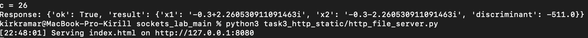
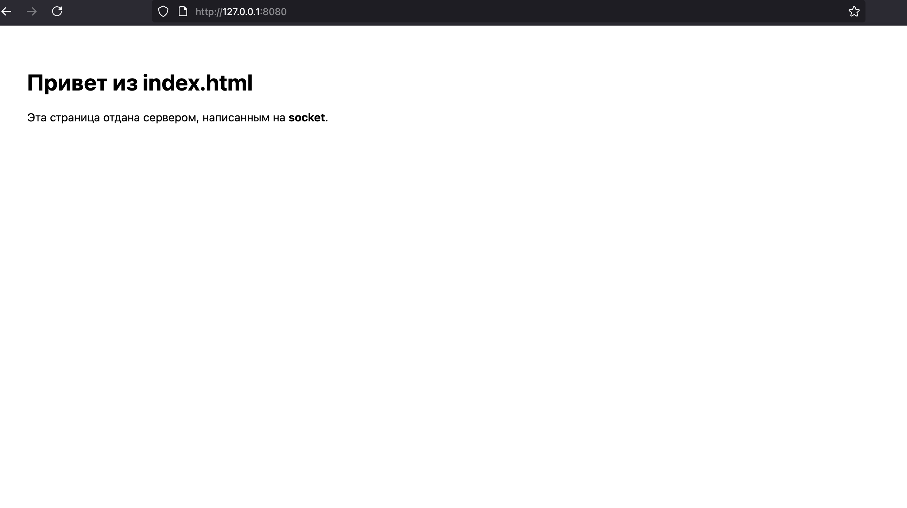

# Задание 3 — HTTP из файла (index.html)

**Требование:** использовать `socket`. Сервер должен отдать **корректный HTTP-ответ** с HTML-страницей.

---

## Как выполнено
- TCP-сервер читает HTTP-запрос: `req = conn.recv(65536)`.
- Если `index.html` есть — формируем `200 OK`; иначе — `404 Not Found`.
- Заголовки: `Content-Type`, `Content-Length`, `Connection: close`.

```python
def http_response(status, headers, body: bytes) -> bytes:
    head = f"HTTP/1.1 {status}\r\n" + "".join(f"{k}: {v}\r\n" for k, v in headers.items()) + "\r\n"
    return head.encode("utf-8") + body
```

```python
if INDEX.exists():
    body = INDEX.read_bytes()
    resp = http_response("200 OK", {
        "Content-Type": "text/html; charset=utf-8",
        "Content-Length": str(len(body)),
        "Connection": "close",
    }, body)
else:
    msg = b"<h1>404 Not Found</h1>"
    resp = http_response("404 Not Found", {
        "Content-Type": "text/html; charset=utf-8",
        "Content-Length": str(len(msg)),
        "Connection": "close",
    }, msg)
conn.sendall(resp)
```

---

## Нюансы
- **`Content-Length`** обязателен — браузеру нужна длина тела.
- Отладка тут: `curl -v http://127.0.0.1:8080`.

---

## Разбор синтаксиса
- `recv(65536)` — тение запроса.
- `Path.read_bytes()` — чтение файла как bytes.
- `sendall()` — отправка всего ответа.

---

## Скриншоты



