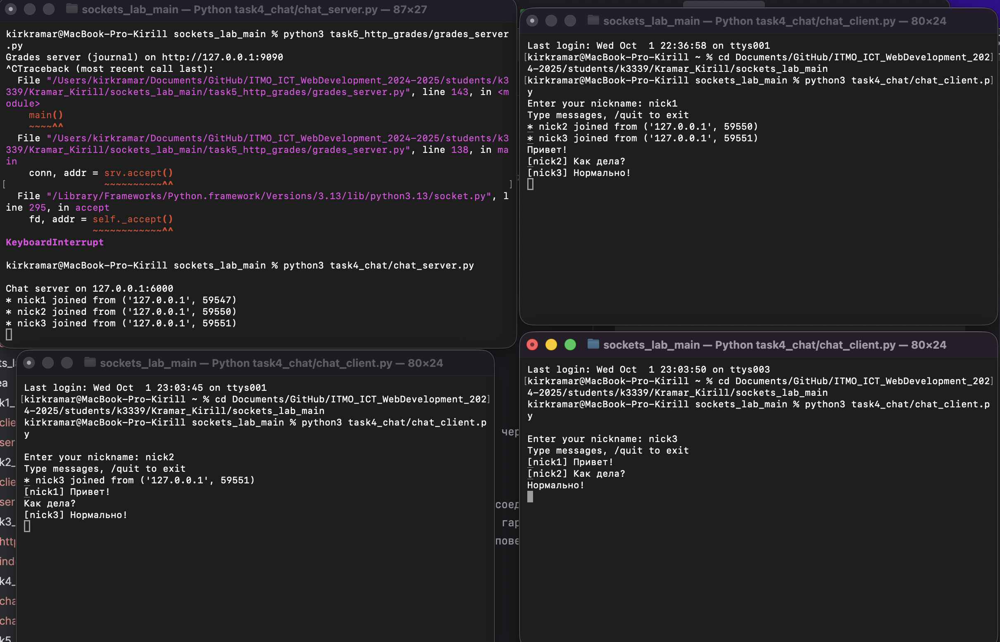
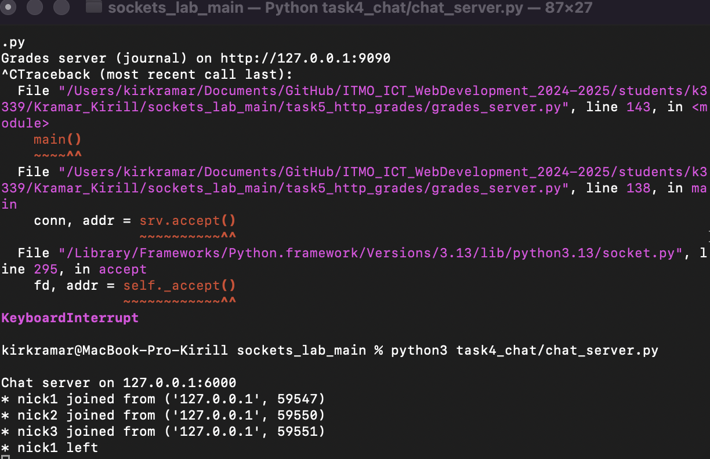

# Задание 4 — Многопользовательский чат (TCP + threading)

**Требование:** чат **многопользовательский**; используем **один и тот же** `chat_client.py`, запущенный несколько раз.

---

## Как выполнено
**Сервер** (`task4_chat/chat_server.py`):
- TCP-сервер; на каждого клиента — `threading.Thread`.
- Реестр клиентов `dict[socket -> (nickname, addr)]` под `Lock`.
- **Broadcast**: сообщения клиента → всем остальным.
- Протокол: ник при входе; `/quit` — завершение.

```python
clients_lock = threading.Lock()
clients = {}

def broadcast(sender_sock, message: str) -> None:
    dead = []
    with clients_lock:
        for sock, (nick, addr) in list(clients.items()):
            if sock is sender_sock: continue
            try:
                sock.sendall(message.encode("utf-8"))
            except OSError:
                dead.append(sock)
        for d in dead:
            clients.pop(d, None)
```

**Клиент** (`task4_chat/chat_client.py`):
- Один процесс = один пользователь (запускаем 2–3 раза один файл).
- Поток-приёмник непрерывно читает `recv` и печатает, основной — читает stdin и отправляет `sendall()`.

---

## Нюансы
- **TCP** гарантирует порядок/надёжность — важно для чата.
- **Threads** — простая и наглядная многопользовательская модель.
- `Lock` защищает общий словарь от гонок.
- `threading.Thread(target=..., daemon=True)` — фоновые обработчики.
- `sock.sendall(...) / sock.recv(...)` — обмен по TCP.
- Удаление «мертвых» сокетов при исключениях.
- Ник по умолчанию — `ip:port`, если отправлена пустая строка.

---

## Скриншоты



