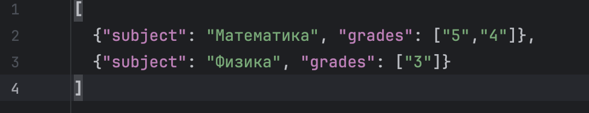
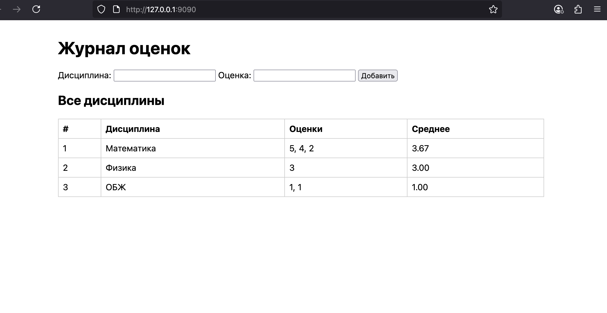
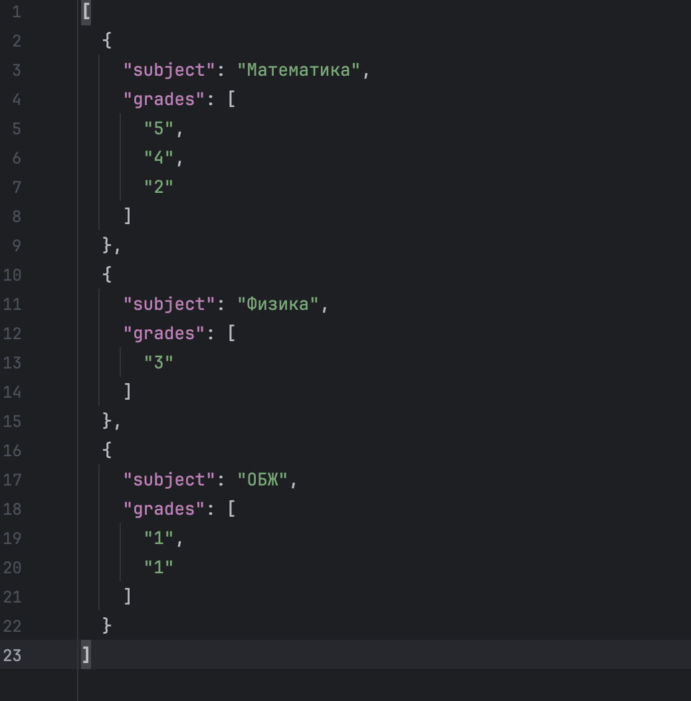

# Задание 5 — HTTP журнал (GET/POST)

**Требование:** журнал хранит **одну строку на дисциплину**, внутри — **список оценок**.  

---

## Как выполнено
- **GET /** — HTML-страница: форма + таблица дисциплин.
- **POST /submit** — принимает `subject`, `grade` (`application/x-www-form-urlencoded`), обновляет `grades.json`, делает **303 See Other** редирект на `/`.
- Формат `grades.json`:
```json
[
  {"subject": "Математика", "grades": ["5","4"]},
  {"subject": "Физика", "grades": ["3"]}
]
```

Ключевое:
```python
# Чтение тела по Content-Length
content_length = int(headers.get("content-length", "0") or "0")
while len(body) < content_length:
    body += conn.recv(4096)

# Парсинг формы
params = parse_qs(body.decode("utf-8"))
subject = (params.get("subject", [""])[0]).strip() or "Без названия"
grade = (params.get("grade", [""])[0]).strip()

# Агрегация по предмету
for rec in items:
    if rec["subject"] == subject:
        rec["grades"].append(grade)
        break
else:
    items.append({"subject": subject, "grades": [grade]})
save_db(items)

# 303 Redirect (после POST — на GET /)
resp = http_response("303 See Other", {"Location": "/", "Content-Length": "0", "Connection":"close"}, b"")
```

---

## Нюансы
- Сделал по требованию «журнал» → **агрегация** по предмету, накопление оценок в списке.
- **303 See Other** — правильный пост-паттерн: F5 не повторяет POST.
- `parse_qs` — стандартный разбор `x-www-form-urlencoded` без фреймворков.
- Отделяем заголовки/тело по `\r\n\r\n`.
- `urllib.parse.parse_qs` возвращает `dict[str, list[str]]` → берём `[0]`.
- `json.dumps(..., ensure_ascii=False, indent=2)` — читабельный UTF-8 JSON.

---

## Скриншоты
- 
- 
- 